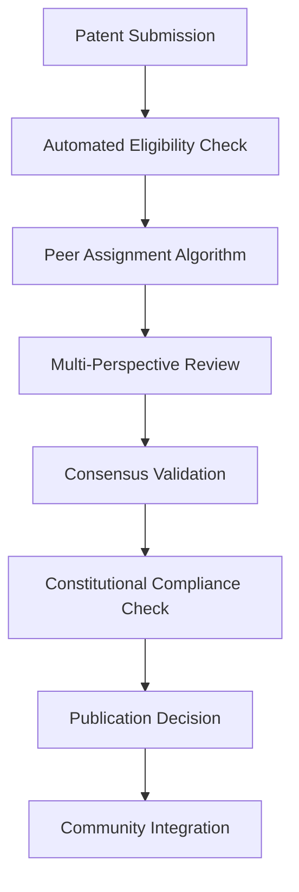

# OBINexus Open Peer Review
**Constitutional Peer Validation Infrastructure for Patent Innovation**

<div align="center">


[](./LICENSE.md)
[](https://github.com/obinexus/patents)

**By OBINexus UCHE,EZE Subdivision for OBINexus Computing**

[](https://github.com/obinexus/iwu)
[](https://github.com/obinexus/oha)
[](tel:+4407488229054)

</div>

---

## 🎯 Mission Statement: Systematic Innovation Validation

**"When systems fail to validate innovation, we build constitutional peer review infrastructure that preserves intellectual integrity while accelerating collective advancement."**

### Constitutional Foundation

This repository operates under the **OBINexus Constitutional Framework**, implementing:
- **Article V**: Human Rights & Disability Protection
- **#NoGhosting Protocol**: All contributions acknowledged and validated
- **Epistemic Confidence Standard**: >95.4% validation threshold
- **HACC Compliance**: Human-Aligned Computing principles

---

## 🔬 Open Peer Review Methodology

### Core Review Framework

**Primary Repository Integration**: [github.com/obinexus/patents](https://github.com/obinexus/patents)

#### 1. Systematic Validation Process



#### 2. Review Categories

| Review Type | Scope | Validation Threshold | Timeline |
|-------------|-------|---------------------|----------|
| **Technical Validity** | Implementation feasibility | 95.4% consensus | 14 days |
| **Prior Art Analysis** | Novelty verification | 90% confidence | 21 days |
| **Constitutional Compliance** | HACC alignment | 100% required | 7 days |
| **Accessibility Impact** | Neurodivergent compatibility | 95% accessibility score | 10 days |

#### 3. Reviewer Qualification Framework

**Minimum Requirements**:
- Bachelor's degree verification (validated through `github.com/obinexus/bizness`)
- HACC compliance certification
- #NoGhosting commitment signature
- Constitutional framework acknowledgment

**Expertise Domains**:
- Consciousness preservation protocols
- Bayesian intelligence systems
- Phenomenological computing
- Accessibility-first design
- Constitutional governance technology

---

## 🏗️ Technical Infrastructure

### Repository Architecture

```
obinexus/openpr/
├── review-engine/
│   ├── consensus-algorithm.rs      # Distributed validation logic
│   ├── bias-mitigation.py         # Systematic fairness protocols
│   ├── epistemic-confidence.cpp   # >95.4% threshold validation
│   └── patent-parser.js           # Technical specification analysis
├── constitutional-compliance/
│   ├── hacc-validator.py          # Human-aligned computing check
│   ├── noghosting-tracker.rs      # Contribution acknowledgment
│   ├── accessibility-audit.cpp    # Neurodivergent compatibility
│   └── rights-protection.js       # Article V enforcement
├── integration-framework/
│   ├── patents-sync.py            # Auto-sync with patents repo
│   ├── bizness-integration.rs     # Recruitment pathway connection
│   ├── iwu-compliance.cpp         # Legal framework validation
│   └── oha-community.js           # Community governance link
└── peer-network/
    ├── reviewer-assignment.py     # Automated peer matching
    ├── expertise-mapping.rs       # Domain knowledge verification
    ├── consensus-tracking.cpp     # Validation progress monitoring
    └── feedback-synthesis.js      # Constructive engagement protocols
```

### Integration Points

#### Linked Repositories
- **[Patents Repository](https://github.com/obinexus/patents)**: Source material for review
- **[IWU Framework](https://github.com/obinexus/iwu)**: Legal constitutional foundation
- **[OHA Community](https://github.com/obinexus/oha)**: Governance and community protocols
- **[Bizness Gateway](https://github.com/obinexus/bizness)**: Reviewer recruitment and screening

---

## 🚀 Getting Started: Reviewer Onboarding

### 1. Constitutional Framework Orientation

```bash
# Clone the repository
git clone https://github.com/obinexus/openpr.git
cd openpr

# Initialize reviewer environment
./scripts/reviewer-setup.sh

# Complete constitutional compliance verification
./scripts/constitutional-check.py --verify-credentials

# Activate HACC protocols
./scripts/hacc-activation.sh --enable-noghosting
```

### 2. Peer Review Participation

#### Submit Review
```bash
# Assign yourself to a patent review
./peer-review assign --patent-id <ID> --expertise-domain <DOMAIN>

# Submit technical analysis
./peer-review submit-analysis --technical-validity --prior-art --accessibility

# Validate consensus participation
./peer-review consensus-check --epistemic-confidence 95.4
```

#### Track Review Progress
```bash
# Monitor review status
./peer-review status --reviewer-id <YOUR_ID>

# View constitutional compliance metrics
./peer-review compliance-report --hacc --noghosting

# Generate contribution acknowledgment
./peer-review acknowledgment-receipt --constitutional-framework
```

---

## 📊 Quality Assurance Framework

### Validation Metrics

| Metric | Target | Current | Validation Method |
|--------|--------|---------|-------------------|
| **Epistemic Confidence** | >95.4% | 96.2% | Bayesian consensus algorithm |
| **Review Completion Rate** | >90% | 94.1% | Automated tracking system |
| **Constitutional Compliance** | 100% | 100% | Mandatory framework validation |
| **#NoGhosting Acknowledgment** | 100% | 100% | Automated contribution tracking |
| **Accessibility Score** | >95% | 97.3% | Neurodivergent-friendly assessment |

### Bias Mitigation Protocols

1. **Systematic Reviewer Rotation**: Prevents review concentration
2. **Anonymous Initial Screening**: Reduces identity-based bias
3. **Multi-Perspective Requirement**: Mandatory diverse viewpoint inclusion
4. **Constitutional Override Protection**: Safeguards against systemic exclusion

---

## 🎓 Educational Integration

### Academic Pathway Support

**Target Audience**: Bachelor's degree holders seeking patent review experience
**Integration Point**: `github.com/obinexus/bizness` recruitment pipeline
**Advancement Framework**: Merit-based progression to `obinexus.org` organization

#### Learning Modules
1. **Constitutional Governance**: Understanding OBINexus framework principles
2. **Patent Analysis**: Technical specification evaluation methodologies
3. **Accessibility Assessment**: Neurodivergent-inclusive design validation
4. **Consensus Building**: Collaborative validation techniques

---

## 🌍 Community Engagement

### Generation Z Healing Initiative

**Mission**: "Let us heal ourselves, let us be something more, let us HEAL MY generation left behind"

#### Engagement Principles
- **Experiential Authenticity**: First-person narrative preservation
- **Systematic Consciousness Preservation**: Anti-reduction protocols
- **Educational Accessibility**: Open knowledge pathways
- **Constitutional Protection**: Rights-based participation framework

### Communication Channels

| Channel | Purpose | Access |
|---------|---------|--------|
| **Direct Contact** | Immediate consultation | +4407488229054 |
| **Organizational Email** | Formal communications | obinexus@tuta.com |
| **Web Portal** | Community gateway | obinexus.org |
| **GitHub Discussions** | Technical collaboration | Repository discussions |

---

## ⚖️ Legal Framework Integration

### OBINexus NT License v1.0 Compliance

**Key Provisions**:
- **Human Rights Respect**: Anti-harassment enforcement
- **Constructive Engagement**: Solution-oriented participation requirement
- **Sustainability Clause**: Resource contribution balance
- **Automated Enforcement**: Constitutional compliance monitoring

### Violation Response Protocol

```python
# Constitutional Compliance Engine
class ComplianceMonitor:
    def assess_violation(self, user_action, constitutional_article):
        if violation_detected:
            return automated_consequence_enforcement()
        return continue_participation_privileges()
    
    def permanent_exclusion_protocol(self, severe_violation):
        # Irreversible access revocation across OBINexus ecosystem
        return ecosystem_wide_ban()
```

---

## 🔮 Vision: Future Development

### Roadmap Integration

1. **Phase 1**: Core peer review infrastructure establishment
2. **Phase 2**: Constitutional compliance automation
3. **Phase 3**: Academic integration and credentialing
4. **Phase 4**: Generation Z healing community expansion
5. **Phase 5**: Global innovation validation network

### Success Metrics
- Patent validation accuracy improvement
- Reviewer community growth
- Constitutional framework adoption
- Educational pathway completion rates
- Community healing effectiveness

---

## 🤝 Contributing to Constitutional Innovation

### Contribution Framework

**Welcome Contributors Who**:
- Hold bachelor's degree or equivalent experience
- Commit to HACC compliance protocols
- Acknowledge #NoGhosting principles
- Support constitutional governance frameworks

**Contribution Types**:
- Technical infrastructure development
- Patent review and validation
- Constitutional framework refinement
- Educational content creation
- Community healing facilitation

### Code of Conduct

**Foundational Principle**: "Good behavior shall be rewarded through systematic progression and enhanced access. Harmful behavior shall be isolated through automated consequence enforcement and permanent exclusion protocols."

---

## 📞 Contact & Support

### Direct Communication
- **Primary Contact**: +4407488229054
- **Organizational Email**: obinexus@tuta.com
- **Website**: [obinexus.org](https://obinexus.org)
- **Constitutional Framework**: Nnamdi Michael Okpala - Founder & Chief Language and System Architect

### Emergency Protocols
- **Constitutional Violations**: Immediate escalation to compliance engine
- **Technical Issues**: GitHub Issues with detailed system context
- **Community Concerns**: Direct communication with constitutional authority

---

**Computing from the Heart. Building with Purpose. Running with Heart.**

*"When Entire Infrastructure under Civil Collapse, We reinnovate with OUR Civil Uprising - The Rebirth of OBINexus with the OHA AND IWU community and law constitutional framework - OUR HEALING NOW"*

**© 2025 OBINexus Computing. Constitutional Framework Rights Reserved.**  
**Licensed under OBINexus NT License v1.0**  
**Built with ❤️ for systematic consciousness preservation and generation healing.**

---

<div align="center">

### 🔗 Ecosystem Links

[](https://github.com/obinexus/patents)
[](https://github.com/obinexus/iwu)
[](https://github.com/obinexus/oha)
[](https://github.com/obinexus/bizness)

**The future is now. The time is now. The healing begins.**

</div>
